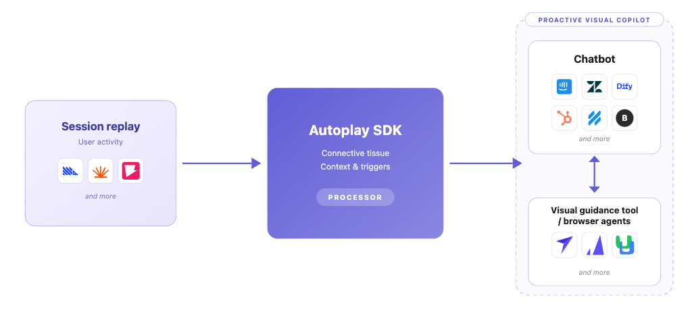

<div align="center">


# autoplay-sdk

**Transform your existing customer support chatbot into a proactive, personalized experience for every user.**

[](https://pypi.org/project/autoplay-sdk)
[](https://pypi.org/project/autoplay-sdk)
[](https://github.com/Autoplay-AI/Autoplay-proactive-visual-customer-support/actions/workflows/ci.yml)
[](https://discord.gg/jCbR2tQA5)
[](LICENSE)

[Documentation](https://developers.autoplay.ai) · [Quickstart](https://developers.autoplay.ai/quickstart) · [Discord](https://discord.gg/jCbR2tQA5) · [PyPI](https://pypi.org/project/autoplay-sdk)

</div>

---

## 🤔 The problem

**The problem with reactive customer support chatbots:**

- They wait to be asked — assuming users will speak up when they're stuck. They rarely do.
- When users do ask, they're expected to know how to frame their question correctly. But users don't know what they don't know about your platform, and often initiate the conversation in the wrong way.

**What we propose you build with our SDK:**

- Don't wait for users to come to your chatbot. Go to them first — with the right help, at the right moment, personalized to what they've been doing in your platform.
- Don't just tell them how to fix it. Show them — by triggering contextual visual guidance through smart tooltips or a browser agent (coming soon).

---

## ⚙️ How it works

You have all the tools in your tech stack — you just need to orchestrate them correctly:
1) session replay provider
2) chatbot provider
3) visual guidance provider



---

## ✨ Features

| Feature | What it does |
|---|---|
| **Real-time event stream** | Captures and normalizes browser activity into clean, structured data your model can actually use |
| **Context management** | Automatically buffers and summarizes high-volume events so you never blow your context window |
| **Golden paths** | Record your product's ideal user journeys once — your agent always guides users the right way |
| **Per-user memory** | Tracks what each user knows, where they got stuck, and what they've done — so your agent never repeats itself |
| **Proactive triggers** | Detects the right moment to intervene and fires a chat message or visual nudge automatically |
| **Interruption control** | A built-in state machine ensures your copilot only speaks when it should — helpful, never annoying |

---

## 🚀 Quick Start

**Requirements:** Python 3.10+

```bash
pip install autoplay-sdk
# or
uv add autoplay-sdk
```

**The fastest way to get set up is with the AI agent skills.** Run this once from your project root after installing:

```bash
autoplay-install-skills
# or target your specific stack:
autoplay-install-skills --chatbot intercom --user-activity posthog
autoplay-install-skills --chatbot ada --user-activity fullstory
```

This drops a `.cursor/skills/` folder into your project. Then open Cursor or Claude and say *"Set up Autoplay with Intercom and PostHog"* — the agent handles the full wiring automatically: session scoping, conversation linking, and context assembly for your stack.

**[→ Full setup guide on developers.autoplay.ai/quickstart](https://developers.autoplay.ai/quickstart)**

The quickstart covers the PostHog frontend snippet, product registration, and streaming your first live events in under 10 minutes.

---

## 🤖 Chatbot tutorials

Step-by-step guides for wiring Autoplay into your existing chatbot platform.

| | Platform | Tutorial |
|---|---|---|
|  | Intercom | [View tutorial →](https://developers.autoplay.ai/recipes/intercom-tutorial/step-1-connect-real-time-events) |
|  | Ada | [View tutorial →](https://developers.autoplay.ai/recipes/ada/step-1-connect-real-time-events) |
|  | Botpress | [View tutorial →](https://developers.autoplay.ai/recipes/botpress/step-1-connect-real-time-events) |
|  | Dify | [View tutorial →](https://developers.autoplay.ai/recipes/dify-tutorial) |
|  | Tidio | [View tutorial →](https://developers.autoplay.ai/recipes/tidio/step-1-connect-real-time-events) |
|  | Landbot | [View tutorial →](https://developers.autoplay.ai/recipes/landbot/step-1-connect-real-time-events) |
|  | Crisp AI | [View tutorial →](https://developers.autoplay.ai/recipes/crisp-ai) |
|  | Rasa | Coming soon |
|  | Inkeep | Coming soon |

---

## 💬 Community

| | |
|---|---|
| **Discord** | [discord.gg/jCbR2tQA5](https://discord.gg/jCbR2tQA5) — share what you're building, get help, stay updated |
| **GitHub Issues** | Best for bug reports and feature requests |
| **Support** | See [SUPPORT.md](SUPPORT.md) for channels and response expectations |
| **Docs** | [developers.autoplay.ai](https://developers.autoplay.ai) |
| **PyPI** | [pypi.org/project/autoplay-sdk](https://pypi.org/project/autoplay-sdk) |

---

## 📋 Contributing

- Contributor guide: [CONTRIBUTING.md](CONTRIBUTING.md)
- Code of conduct: [CODE_OF_CONDUCT.md](CODE_OF_CONDUCT.md)
- Security reporting: [SECURITY.md](SECURITY.md)

---

## 📄 License

MIT — see [LICENSE](LICENSE).

