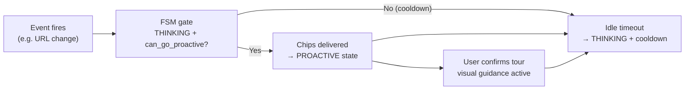
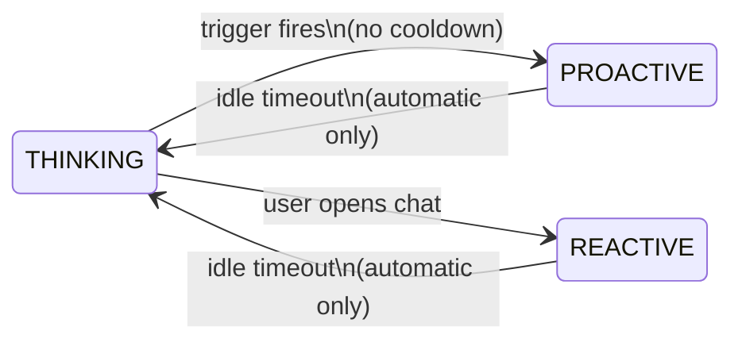

Once you've connected real-time events in [Step 1](./step-1-connect-real-time-events), you can configure the bot to reach out to users **before they ask** — based on what they're doing in your product. Everything is driven by your `products.json` config. No code changes are needed.



---

## Step 1 — Configure agent states

### Why agent states are needed

Without a state layer, a proactive trigger would fire on every URL change, every background poll — indefinitely. The result is a bot that spams users every time they navigate.

**Agent states** solve this by tracking *what mode the session is in right now* and enforcing strict rules about when the bot is allowed to speak first. Think of it as a circuit breaker: chips can only fire in one specific state, and after the user ignores them a cooldown blocks re-firing.

### The three states

`SessionState` (agent state v2) is a finite state machine that runs alongside every active user session.



<Note>
Direct `PROACTIVE ↔ REACTIVE` transitions are never allowed. The only way to exit either active state is via idle timeout — this is enforced by the FSM, not by your code.
</Note>

<CardGroup cols={3}>
  <Card title="THINKING" icon="eye">
    The bot is watching. It evaluates triggers every few seconds. If a trigger fires and no cooldown is active, chips are delivered to the user.
  </Card>
  <Card title="PROACTIVE" icon="bolt">
    Chips have been shown. The bot is waiting. Any interaction — chat message, chip tap, or tour step — resets the idle timer. Silence for `interaction_timeout_s` returns the session to THINKING with a cooldown.
  </Card>
  <Card title="REACTIVE" icon="message">
    The user opened the chat themselves. The bot responds normally via the RAG pipeline. The same idle timeout applies — silence returns to THINKING.
  </Card>
</CardGroup>

### Why the cooldown matters

After returning to `THINKING` from either active state, `cooldown_period_s` prevents the bot from immediately re-offering. Without it, a user who ignores the chips would be re-prompted on the very next URL change. The cooldown enforces a respectful wait.

### Configuration

Both timing values live at the top level of `integration_config` in your `products.json`:

```json
{
  "integration_config": {
    "interaction_timeout_s": 20.0,
    "cooldown_period_s": 60.0
  }
}
```

| Field | Default | Meaning |
| --- | --- | --- |
| `interaction_timeout_s` | `20.0` s | How long the user can go without any interaction (chat, chip tap, or tour step) before the session returns to `THINKING`. Applies in both `PROACTIVE` and `REACTIVE`. |
| `cooldown_period_s` | `60.0` s | After returning to `THINKING`, how long before a proactive trigger can fire again. Auto-clears once the period elapses. |

<Info>
Per-tour overrides for both values are possible via the [tour registry](#step-3--add-a-user-tour-optional). If a tour is active and a matching registry entry exists, the tour's values take precedence over the session defaults above.
</Info>

See [Agent session states](/sdk/agent-states) for the full transition rules, persistence API, and Python examples.

---

## Step 2 — Define proactive triggers

There are **two separate config keys** that work together to make proactive messaging work:

- **`proactive_triggers.builtins`** — the *detection* side: which built-in rules watch the user's behaviour and decide when to fire.
- **`proactive_intercom`** — the *delivery* side: what chips to show the user when a trigger fires.

Both live inside `integration_config`. You need both.

### Built-in triggers

The SDK ships three ready-to-use detection triggers you can enable with no code:

| ID | Fires when | Notes |
| --- | --- | --- |
| `canonical_url_ping_pong` | User bounces between the same URLs | Active by default — no config needed |
| `user_page_dwell` | User lingers on a page with few actions | Tunable via `dwell_threshold_seconds` |
| `section_playbook_match` | User is in a section that has a playbook entry | Requires `section_url_rules` + `section_playbook` |

Enable them by adding a `builtins` array to `integration_config.proactive_triggers`. Each row requires `id`, `name`, and `description`:

```json
{
  "integration_config": {
    "proactive_triggers": {
      "builtins": [
        {
          "id": "canonical_url_ping_pong",
          "name": "URL hesitation",
          "description": "Fires when the user bounces between the same URLs"
        },
        {
          "id": "user_page_dwell",
          "name": "Page dwell",
          "description": "Fires when the user lingers on a page without doing much"
        }
      ]
    }
  }
}
```

See [Built-in proactive triggers](/sdk/proactive-triggers-builtins) for the full reference on each trigger — tuning params, result metadata, and advanced config.

### Chip delivery (`proactive_intercom`)

`proactive_intercom` is where you define the chips shown to the user when any trigger fires. Triggers are defined in `integration_config.proactive_intercom` as a **list** — you can have multiple entries for different pages or conditions.

Each trigger has four fields:

| Field | Required | Meaning |
| --- | --- | --- |
| `id` | yes | Stable machine identifier — never change this once deployed |
| `name` | yes | Human-readable label used in logs and dashboards |
| `proactive_criteria` | yes | Detection rule — see [criteria types](#criteria-types) below |
| `messages` | yes | 1–3 chips shown to the user when the trigger fires |

### Criteria types

A criterion is either a **leaf** (a single detection rule) or a **group** (logical combination of rules).

**Leaf** — a single condition:

```json
{
  "id": "url_change",
  "name": "URL change",
  "type": "url_change"
}
```

**Group** — combine multiple conditions with `AND` or `OR`:

```json
{
  "id": "url_and_activity",
  "name": "URL change and recent activity",
  "operator": "AND",
  "conditions": [
    { "id": "url_change", "name": "URL change", "type": "url_change" },
    { "id": "recent_action", "name": "Recent action", "type": "user_property" }
  ]
}
```

Groups can nest — a condition inside a group can itself be a group.

### Chip messages

Each chip in `messages` is shown as a quick-reply option when the trigger fires. Up to 3 chips per trigger.

| Field | Required | Meaning |
| --- | --- | --- |
| `id` | yes | Stable chip identifier — referenced by the tour registry |
| `label` | yes | Text shown on the chip in Intercom |
| `user_tour_exists` | yes | `true` if tapping this chip can launch a visual guidance tour |
| `user_tour_id` | if `user_tour_exists: true` | Intercom flow ID for the tour — must match an entry in `tour_registry` |

### Example trigger (no tour)

```json
{
  "id": "trig_001",
  "name": "Projects page helper",
  "proactive_criteria": {
    "id": "url_change",
    "name": "URL change",
    "type": "url_change"
  },
  "messages": [
    {
      "id": "chip_new_project",
      "label": "Need help creating a new project?",
      "user_tour_exists": false
    },
    {
      "id": "chip_api_key",
      "label": "Need help accessing API key?",
      "user_tour_exists": false
    },
    {
      "id": "chip_access_project",
      "label": "Need help accessing a project?",
      "user_tour_exists": false
    }
  ]
}
```

### Example trigger (with a tour chip)

When one chip launches a visual tour, add `user_tour_exists: true` and the Intercom flow ID. Other chips in the same trigger can still be tour-less.

```json
{
  "id": "trig_001",
  "name": "Projects page helper",
  "proactive_criteria": {
    "id": "url_change",
    "name": "URL change",
    "type": "url_change"
  },
  "messages": [
    {
      "id": "chip_new_project",
      "label": "Need help creating a new project?",
      "user_tour_exists": true,
      "user_tour_id": "<your_intercom_flow_id>"
    },
    {
      "id": "chip_api_key",
      "label": "Need help accessing API key?",
      "user_tour_exists": false
    },
    {
      "id": "chip_access_project",
      "label": "Need help accessing a project?",
      "user_tour_exists": false
    }
  ]
}
```

<Warning>
`user_tour_id` must match an entry in `tour_registry` (Step 3 below). If no matching entry exists, the session falls back to the session-level `interaction_timeout_s` and `cooldown_period_s` instead of tour-specific values.
</Warning>

---

## Step 3 — Add a user tour (optional)

When a chip launches an Intercom visual guidance tour, the **tour registry** tells the session how long to keep the user in `PROACTIVE` while the tour is running — and what cooldown to apply once they finish (or go idle).

### Why a separate registry?

The tour registry is kept **separate from the trigger config** by design. A single tour can be referenced by chips in multiple triggers, and different tours can have completely different timeout behaviours — independent of which trigger originally fired.

### How it works

When a user confirms a tour:

1. `SessionState.active_tour_id` is set to the `user_tour_id` (the Intercom flow ID).
2. On every background tick, the session looks up the active tour in the registry using `user_tour_id`.
3. If found, `interaction_timeout_s` and `cooldown_period_s` from the registry entry are used instead of the session defaults.
4. Any tour step (page advance, step complete) calls `record_tour_step()` — this resets the idle timer so the tour keeps the session alive even if the user never types in the chat.
5. When the user goes idle for the tour's `interaction_timeout_s`, the session returns to `THINKING` and starts the tour's `cooldown_period_s`.

### How the lookup works

When a user taps a chip with `user_tour_exists: true`, the session reads `user_tour_id` from that chip and looks for a matching entry in the registry using the same value:

```
chip.user_tour_id  ==  registry_entry.user_tour_id
```

`user_tour_id` is the **only lookup key** — it must match the Intercom flow ID exactly. The `id` field in each registry entry is only for human readability and log correlation; it plays no role in the lookup.

### Configuration

Add entries to `integration_config.tour_registry` — a flat list, separate from `proactive_intercom`:

```json
{
  "integration_config": {
    "tour_registry": [
      {
        "id": "chip_new_project",
        "user_tour_id": "<your_intercom_flow_id>",
        "user_tour_name": "Create new project",
        "interaction_timeout_s": 30.0,
        "cooldown_period_s": 120.0
      }
    ]
  }
}
```

| Field | Required | Default | Meaning |
| --- | --- | --- | --- |
| `id` | yes | — | Human-readable label for logs and dashboards — **not** the lookup key |
| `user_tour_id` | **yes** | — | **The lookup key.** Must exactly match the Intercom flow ID set on the chip (`messages[].user_tour_id`). |
| `user_tour_name` | no | — | Human-readable tour name for logs and dashboards |
| `interaction_timeout_s` | no | session default | How long tour progress (or chat) keeps the session in `PROACTIVE` before it returns to `THINKING`. Omit to inherit the session-level value from Step 1. |
| `cooldown_period_s` | no | session default | Cooldown applied after this specific tour ends or times out. Omit to inherit the session-level value from Step 1. |

<Info>
You only need to set `interaction_timeout_s` or `cooldown_period_s` when this tour requires different timing from the rest of the session. Omitting them falls back to the session-level defaults set in Step 1 (`integration_config.interaction_timeout_s` / `cooldown_period_s`).
</Info>

<Warning>
If no registry entry matches a chip's `user_tour_id`, the session does not error — it silently falls back to the session-level `interaction_timeout_s` and `cooldown_period_s`. Always check that every chip with `user_tour_exists: true` has a corresponding registry entry with the same `user_tour_id`.
</Warning>

---

## Full example config

This is the complete `integration_config` for a product with one trigger and one tour — matching the structure used in production:

```json
{
  "integration_config": {
    "access_token": "<your_intercom_access_token>",
    "admin_id": "<your_intercom_admin_id>",

    "interaction_timeout_s": 20.0,
    "cooldown_period_s": 60.0,

    "proactive_intercom": [
      {
        "id": "trig_001",
        "name": "Projects page helper",
        "proactive_criteria": {
          "id": "url_change",
          "name": "URL change",
          "type": "url_change"
        },
        "messages": [
          {
            "id": "chip_new_project",
            "label": "Need help creating a new project?",
            "user_tour_exists": true,
            "user_tour_id": "<your_intercom_flow_id>"
          },
          {
            "id": "chip_api_key",
            "label": "Need help accessing API key?",
            "user_tour_exists": false
          },
          {
            "id": "chip_access_project",
            "label": "Need help accessing a project?",
            "user_tour_exists": false
          }
        ]
      }
    ],

    "tour_registry": [
      {
        "id": "chip_new_project",
        "label": "Need help creating a new project?",
        "user_tour_exists": true,
        "user_tour_id": "<your_intercom_flow_id>",
        "user_tour_name": "Create new project",
        "interaction_timeout_s": 30.0,
        "cooldown_period_s": 120.0
      }
    ]
  }
}
```

---

## Checklist

<Steps>
  <Step title="Set session-level timeouts">
    Add `interaction_timeout_s` and `cooldown_period_s` to `integration_config`. Start with the defaults (`20.0` / `60.0`) and tune from there.
  </Step>
  <Step title="Add a trigger to proactive_intercom">
    Define at least one object in the `proactive_intercom` list with an `id`, `name`, `proactive_criteria`, and `messages` (1–3 chips). Set `user_tour_exists: false` on any chip that doesn't launch a tour.
  </Step>
  <Step title="Mark tour chips (if applicable)">
    For any chip that launches an Intercom visual guidance tour, set `user_tour_exists: true` and add the Intercom flow ID as `user_tour_id`.
  </Step>
  <Step title="Add the tour to tour_registry (if applicable)">
    Add a matching entry to the `tour_registry` list using the same `user_tour_id`. Set `interaction_timeout_s` and `cooldown_period_s` to control how long the tour keeps the session alive and how long the post-tour cooldown lasts.
  </Step>
  <Step title="Restart the connector">
    Deploy or restart the event connector to pick up the new config. No code changes are needed — everything is read from `products.json` at startup.
  </Step>
</Steps>

---

**Back to overview:** [Intercom tutorial](./)
