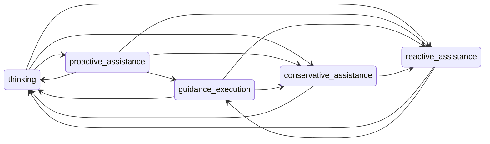

The **`autoplay_sdk.agent_states`** package (v1) is deprecated — use **`autoplay_sdk.agent_state_v2`** (`SessionState`) for all new integrations. Use the accordions below to read about each model separately.

## Picking v1 vs v2

| If you are... | Recommended model | Why |
| --- | --- | --- |
| Building a new copilot integration | `autoplay_sdk.agent_state_v2.SessionState` | Simpler 3-state model, stricter transitions, timeout-only exits. |
| Running an existing deployment on v1 | `autoplay_sdk.agent_states.AgentStateMachine` (temporary) | Avoid forced migration during active rollout; migrate on your schedule. |
| Needing v1-specific capabilities right now (task progress + conservative gating controls) | `AgentStateMachine` | v1 still exposes richer task/cooldown controls while supported. |

For new integrations, start with v2 unless you have a specific v1 requirement.

<AccordionGroup>

<Accordion title="Agent state v1 — AgentStateMachine (5 states) — DEPRECATED">

<Warning>
**`agent_states` (v1) is deprecated and will be removed on 1 June 2026.** New integrations should use `agent_state_v2` (`SessionState`) instead. Migrate before that date to avoid breaking changes.
</Warning>

## Why session states?

Copilot **session** state answers "what mode is the product relationship in right now?" — distinct from a single chat turn or a LangGraph node. You need it so that:

- **Proactive gating** — Unsolicited offers are only evaluated in **`thinking`** (subject to route/flow cooldowns). **`conservative_assistance`** backs off after dismissals or abandoned guidance so you do not spam users who rejected or ghosted a flow.
- **Reactive vs guidance** — **`reactive_assistance`** means the user drove the turn; **`guidance_execution`** means a walkthrough is active and different UX/logging applies. **`proactive_assistance`** records that the assistant surfaced an offer before the user committed.
- **Safe persistence** — One FSM snapshot (**`to_snapshot()`**) restores a coherent mode across workers or restarts; illegal transitions are rejected instead of silently drifting.
- **Telemetry** — **`get_session_snapshot()`** and **`can_show_proactive_with_reason()`** expose stable reason codes for logs and OpenTelemetry.

### States

| Wire value | Meaning |
| --- | --- |
| `thinking` | Idle baseline between signals; proactive may be evaluated subject to cooldowns. |
| `reactive_assistance` | User messaged the assistant; normal reactive reply path. |
| `proactive_assistance` | Assistant surfaced an unsolicited offer (copy/UI). |
| `guidance_execution` | User accepted an offer; step-by-step guidance is active. |
| `conservative_assistance` | Backoff after dismissals or **disengagement** from an active guidance flow. |

Typical happy path: **`thinking` → `reactive_assistance`** (user chats), or **`thinking` → `proactive_assistance`** (assistant offers) → **`guidance_execution`** (user accepts). Leaving guidance without finishing can move to **`conservative_assistance`** via **`transition_on_disengagement()`**, or **`thinking`** via **`complete_task()`** when the flow completes successfully.

### Transition rules

Arrows match **`AgentStateMachine`**'s internal transition matrix. Every move uses **`transition_to`** unless noted. The usual disengagement path is **`guidance_execution` → `conservative_assistance`** via **`transition_on_disengagement()`**.



### Public exports

```python
from autoplay_sdk.agent_states import (
    AgentState,
    AgentStateMachine,
    InvalidSnapshotError,
    InvalidTransitionError,
    ProactiveIdleExpiryResult,
    SessionMetrics,
    TaskProgress,
    proactive_idle_eligible,
    run_proactive_idle_expiry,
)
```

### `AgentStateMachine` constructor

Optional tuning (defaults work for most integrations):

| Parameter | Role |
| --- | --- |
| `base_threshold` | Starting score threshold for proactive gating. |
| `max_tasks` | Cap on concurrent task rows tracked in **`active_tasks`**. |
| `conservative_cooldown_s` | Base cooldown after entering conservative mode. |
| `conservative_threshold_boost` | Raises **`current_threshold`** as dismissals stack. |
| `guidance_deviation_threshold` | Used by **`record_deviation()`** with **NW** scores. |

### Core transitions

- **`transition_to(target, ...)`** — Move to **`AgentState`** when the edge is allowed; no-op if already at **`target`**. Optional **`reason`**, **`task`** (**`TaskProgress`**), and **`instructions`** (guidance payload) when entering **`guidance_execution`**.
- **`enter_reactive_from_user_message(reason=...)`** — Convenience for chat hosts: **`proactive_assistance` → `reactive_assistance`** (and other allowed inbound paths) when the user sends a normal message. No-op if already **`reactive_assistance`**; otherwise delegates to **`transition_to`**, logs a rejection with FSM context.
- **`transition_on_disengagement(reason=...)`** — **`guidance_execution` → `conservative_assistance`** when the user abandons the flow (timeout, closed UI). Raises **`InvalidTransitionError`** if not currently in **`guidance_execution`**.
- **`can_show_proactive()`** / **`can_show_proactive_with_reason()`** — Gate unsolicited offers; **`can_show_proactive_with_reason`** returns **`(bool, reason_code)`** (e.g. **`wrong_state`**, **`conservative_cooldown`**). When conservative cooldown expires, state may auto-return to **`thinking`**.
- **`proactive_idle_eligible(sm, now, interaction_timeout_s)`** — **`True`** when **`expire_proactive_to_thinking_if_idle`** would transition; does not mutate the FSM.
- **`expire_proactive_to_thinking_if_idle(now, interaction_timeout_s)`** — When in **`proactive_assistance`**, if **`now - state_entered_at >= interaction_timeout_s`**, transition to **`thinking`**. Returns **`ProactiveIdleExpiryResult`**. For chat integrations, prefer **`run_proactive_idle_expiry`** so remote delete runs first.

#### Proactive idle expiry (chat integrations)

**`run_proactive_idle_expiry(sm, now=..., interaction_timeout_s=..., hooks=...)`** runs a fixed order: (1) not eligible → skip; (2) **`await hooks.delete_remote_chat_thread()`** must return **`True`**; (3) **`expire_proactive_to_thinking_if_idle`**; (4) **`await hooks.clear_local_chat_thread_state()`**. Implement **`ProactiveIdleExpiryHooks`** for your surface.

### Tasks and metrics

Walkthrough attempts use **`TaskProgress`** (per **`flow_id`**); **`SessionMetrics`** aggregates counters (**`proactive_shown_count`**, **`guidance_accepted_count`**, **`dismissal_count`**, task sets).

| Method | Purpose |
| --- | --- |
| **`start_task(flow_id, flow_name, total_steps)`** | Create or reset a **`TaskProgress`** row in **`active_tasks`**. |
| **`complete_task(flow_id)`** | Mark complete; from **`guidance_execution`**, transitions to **`thinking`** and clears active guidance fields. |
| **`abandon_task(flow_id)`** | Mark abandoned (metrics). |
| **`record_step_completion(flow_id, step_index)`** | Advance step counters. |
| **`record_deviation(flow_id, nw_score)`** | Increment deviation count; returns whether **`nw_score`** is below the deviation threshold. |

Cooldown helpers: **`set_route_cooldown`**, **`set_flow_cooldown`**. Threshold readout: **`get_effective_threshold()`**.

### Snapshots and telemetry helpers

- **`to_snapshot()`** / **`classmethod from_snapshot(data)`** — Round-trip JSON **`dict`** for Redis, DynamoDB, or any store. Includes **`_v`** (= **1**) for forward-compatible migrations; **`from_snapshot`** raises **`InvalidSnapshotError`** on wrong version or malformed payloads.
- **`get_session_snapshot()`** — Compact summary (**tasks**, counters, **`last_state`**, **`last_active_flow`**) for logs or connector attributes.
- **`proactive_state_dict`** (property) — Cooldown timestamps and popup-active flags for orchestration.

The SDK **does not** open Redis itself — persist **`to_snapshot()`** from your host or connector and restore with **`from_snapshot`** on the next request.

### Example

```python
from autoplay_sdk.agent_states import (
    AgentState,
    AgentStateMachine,
    TaskProgress,
)

sm = AgentStateMachine()
sm.transition_to(AgentState.PROACTIVE_ASSISTANCE)
task = sm.start_task("flow_1", "Create contact", 5)
sm.transition_to(
    AgentState.GUIDANCE_EXECUTION,
    task=task,
    instructions=[{"action": "click", "selector": "#save"}],
)

# Persist across requests (e.g. Redis)
blob = sm.to_snapshot()
restored = AgentStateMachine.from_snapshot(blob)
```

</Accordion>

<Accordion title="Agent state v2 — SessionState (3 states)">

## Overview

**`autoplay_sdk.agent_state_v2`** is a simpler, stricter FSM introduced alongside v1 (nothing in v1 was removed). It replaces the five-state model with **three states** and enforces a clear timeout-only exit rule from active states. Timeouts and cooldowns are session-level settings rather than per-trigger values.

### States

| Wire value | Python enum | Meaning |
| --- | --- | --- |
| `thinking` | `AgentStateV2.THINKING` | Idle baseline. Proactive offers may fire — unless the cooldown period is still active. |
| `proactive_assistance` | `AgentStateV2.PROACTIVE` | The assistant surfaced an unsolicited quick-reply offer. User has not yet responded. |
| `reactive_assistance` | `AgentStateV2.REACTIVE` | The user opened the chatbot or sent a message; the session is in active dialogue. |

### Transition rules

| From | To | How | Notes |
| --- | --- | --- | --- |
| `thinking` | `proactive_assistance` | `transition_to_proactive(trigger_id)` | Returns `False` (no state change) if `cooldown_active` is still `True`. Flushes any expired cooldown first. |
| `thinking` | `reactive_assistance` | `transition_to_reactive()` | Always allowed from `THINKING`. Clears cooldown — user initiating a chat cancels the proactive backoff period. |
| `proactive_assistance` | `thinking` | `tick()` only — automatic | **The only exit.** Triggered when `now − last_interaction_at > interaction_timeout_s`. Always starts the cooldown on arrival. |
| `reactive_assistance` | `thinking` | `tick()` only — automatic | **The only exit.** Same timeout rule as above. |
| `proactive_assistance` | `reactive_assistance` | ❌ Never | Raises `InvalidTransitionError`. |
| `reactive_assistance` | `proactive_assistance` | ❌ Never | Raises `InvalidTransitionError`. |
| any → `proactive_assistance` when not `THINKING` | ❌ Never | Raises `InvalidTransitionError`. |
| any → `reactive_assistance` when not `THINKING` | ❌ Never | Raises `InvalidTransitionError`. |

<Note>
`_timeout_to_thinking()` is a private method called exclusively by `tick()`. Never call it directly in your code — use `tick()` on every incoming event or background pulse instead.
</Note>

### Session-level timeout settings

| Field | Default | Meaning |
| --- | --- | --- |
| `interaction_timeout_s` | `20 s` | How long the user can go without interacting with the chatbot or visual guidance before returning to `thinking`. Applies in both `proactive` and `reactive` states. |
| `cooldown_period_s` | `60 s` | After returning to `thinking` from any active state, how long before proactive can fire again. Auto-clears when the period elapses. |

### Per-state sub-dataclasses

Each state carries a typed sub-object that tracks its own metrics. These are reset when the session enters that state.

**`ThinkingState`**

| Field | Type | Meaning |
| --- | --- | --- |
| `cooldown_active` | `bool` | `True` while the cooldown period is blocking a new proactive offer. |
| `cooldown_started_at` | `float` | Monotonic timestamp of when the cooldown began. |
| `can_go_proactive` | property | `True` when `cooldown_active` is `False`. |

**`ProactiveState`**

| Field | Type | Meaning |
| --- | --- | --- |
| `user_clicked_option` | `bool` | `True` once the user taps a quick-reply chip. |
| `time_since_last_interaction_s` | `float` | Seconds since the last interaction of **any** kind — chat message, option click, reaction, or tour step. Updated by `tick()`. |
| `visual_guidance_active` | `bool` | `True` while a tour overlay is running. Can be `True` even if the user **never opened the chat** — visual guidance can fire proactively without any prior chat interaction. |

**`ReactiveState`**

| Field | Type | Meaning |
| --- | --- | --- |
| `time_since_last_interaction_s` | `float` | Seconds since last user interaction. Updated by `tick()`. |
| `visual_guidance_active` | `bool` | `True` while a tour overlay is running. |

### Public exports

```python
from autoplay_sdk.agent_state_v2 import (
    AgentStateV2,
    InvalidTransitionError,
    SessionState,
    ThinkingState,
    ProactiveState,
    ReactiveState,
)
```

<Note>
`InvalidTransitionError` in `agent_state_v2` is a separate class from the one in `agent_states`. Import from the correct module to avoid confusion.
</Note>

### Key methods

| Method | Description |
| --- | --- |
| `tick()` | Evaluate all timeout rules. Call on every incoming event and on a background pulse (e.g. every 5 s) to catch silent timeouts. |
| `transition_to_proactive(trigger_id)` | Move to `PROACTIVE`. Returns `False` if cooldown is active; raises `InvalidTransitionError` if not in `THINKING`. |
| `transition_to_reactive()` | Move to `REACTIVE`. Raises `InvalidTransitionError` if not in `THINKING`. Clears cooldown. |
| `record_any_interaction()` | Reset `last_interaction_at`. Call on any chatbot or visual guidance activity. |
| `record_user_interaction()` | User sent a chat message. |
| `record_option_click()` | User clicked a quick-reply chip. |
| `record_reaction()` | User added an emotional reaction. |
| `record_tour_step()` | Any tour progress (page advance, step complete). Resets the `interaction_timeout_s` countdown even when the user has never opened the chat — visual guidance counts as interaction. |
| `set_visual_guidance(active)` | Toggle `visual_guidance_active` on the current state. Starting a tour (`active=True`) also resets `last_interaction_at`. No-op in `THINKING`. |
| `to_dict()` / `from_dict(d)` | Round-trip JSON snapshot for Redis or any store. `from_dict` raises `ValueError` on wrong `_v`. |

### Persistence

```python
# Save
await save_session(product_id, conversation_id, session)

# Load
session = await load_session(product_id, conversation_id)
session.tick()  # flush any elapsed timeouts before acting
```

The v2 store uses a separate Redis key prefix (`connector:intercom:session_state_v2:{product_id}:{conversation_id}`) so it never collides with v1 snapshots.

### Example

```python
from autoplay_sdk.agent_state_v2 import (
    AgentStateV2,
    InvalidTransitionError,
    SessionState,
)

# Start fresh
session = SessionState(interaction_timeout_s=20.0, cooldown_period_s=60.0)

# Proactive trigger fires
fired = session.transition_to_proactive("trig_001")
assert fired is True
assert session.current_state == AgentStateV2.PROACTIVE

# User clicks a chip
session.record_option_click()

# Background pulse — flush timeouts
session.tick()

# Simulate 25 s of silence → transitions back to thinking with cooldown
session.last_interaction_at -= 25.0
session.tick()
assert session.current_state == AgentStateV2.THINKING
assert session.thinking.cooldown_active is True

# During cooldown, proactive is blocked
assert session.transition_to_proactive("trig_002") is False

# After cooldown expires, proactive is allowed again
session.thinking.cooldown_started_at -= 70.0
session.tick()
assert session.thinking.can_go_proactive is True

# Persist
blob = session.to_dict()
restored = SessionState.from_dict(blob)
```

</Accordion>

</AccordionGroup>

## See also

- [Chatbot context assembly](/sdk/chatbot-context-assembly) — query-time RAG assembly (`rag_query`).
- [Proactive copilot](/sdk/proactive-copilot) — product framing for proactive experiences.
- [Logging](/sdk/logging) — **`autoplay_sdk.agent_states.state_machine`** logger and **`event_type`** keys.
