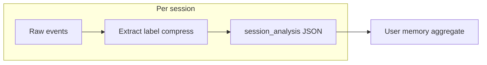

<Note>
  **Coming soon.** A **session analysis** API is planned to list and fetch per-session documents by **user email**, **time range**, and related filters.
</Note>

## Why user memory exists

The SDK already gives **live** context (what the user is doing now). **User memory** adds **history**: what this person has already completed, where they stalled, and what they have never tried. Without it, every user looks like a first-time visitor; with it, the copilot can focus on **gaps** instead of repeating mastered flows.

> **What does this user already know — and what is still new to them?**

---

## Three signals for a proactive copilot

See [Proactive copilot](./proactive-copilot).

| Signal | Answers |
|---|---|
| **Real-time events** | What is the user doing *right now*? |
| **Golden paths** | What *should* they be doing on the journey? |
| **User memory** | What have they *already done*, and where do they struggle? |

User memory is the **relevance filter** between golden-path intent and useful suggestions.

---

## How it works

Raw browser events are noisy for an LLM. Autoplay **extracts**, **labels**, **groups**, and **compresses** them into a short list of meaningful actions per session. That list is fed through the Terra pipeline; each session yields one **`session_analysis`** document. Many sessions roll up into the **cross-session** memory profile.



### In practice

| User history | Copilot leans toward |
|---|---|
| Workflow **mastered** | Skip explaining it; suggest something else |
| **In progress** | Resume at the missed step, not step one |
| **Untouched** high-value flow | Introduce when context fits |
| **Repeated struggle** | Change approach instead of repeating the same hint |

---

## Session analysis document (one session)

**Session-level** output is **one JSON per session** (Terra). **Cross-session user memory** merges many of these over time — not the same as a single session export.

### Planned session API and response shape

We will ship an API to **query session analyses** (e.g. filter by **user email**, **time range**, organization, product). Each matching session is returned as its own **`session_analysis`** document. The example below is the **exact shape** of one such response — also checked in as [`session-analysis.example.json`](./session-analysis.example.json) so you can diff or copy without scrolling the docs.

```json
{
  "schema": {
    "version": 2,
    "min_compatible_version": 2
  },
  "meta": {
    "id": "019d8528-2d42-75b5-acb0-a64548f232fb",
    "organization_id": "4accd098-f1a8-4fb1-9fb6-f9891734a71e",
    "product_id": "97ab8fae-59d8-41d8-a3f3-932240592a67",
    "duration_seconds": 2624.756,
    "source": "posthog",
    "processed_at": null,
    "analyzed_at": "2026-04-20 14:34:07.101888+00:00",
    "analysis_run": {
      "count": 1,
      "reason": "initial",
      "previous_analyzed_at": null
    },
    "pipeline": {
      "version": 0.8,
      "type": "terra",
      "model": {
        "provider": "",
        "name": "vertex_ai/gemini-2.5-flash"
      }
    }
  },
  "urls": {
    "routing_shape": "history",
    "count": 4,
    "pages": [
      {
        "raw_url": "https://app.example.com/sessions",
        "canonical_url": "https://app.example.com/sessions",
        "title": "",
        "start_s": 0.0,
        "end_s": 2504.97,
        "duration_s": 2505.0
      },
      {
        "raw_url": "https://app.example.com/auth/signup?returnTo=%2F",
        "canonical_url": "https://app.example.com/auth/signup",
        "title": "",
        "start_s": 2504.97,
        "end_s": 2533.788,
        "duration_s": 28.8
      },
      {
        "raw_url": "https://app.example.com/sessions",
        "canonical_url": "https://app.example.com/sessions",
        "title": "",
        "start_s": 2533.788,
        "end_s": 2589.384,
        "duration_s": 55.6
      },
      {
        "raw_url": "https://app.example.com/sessions/019d8528-2d42-75b5-acb0-a64548f232fb?mode=&sessionIds=019d8528-2d42-75b5-acb0-a64548f232fb",
        "canonical_url": "https://app.example.com/sessions/:id",
        "title": "",
        "start_s": 2589.384,
        "end_s": 2624.627,
        "duration_s": 35.2
      }
    ]
  },
  "actions": [
    {
      "index": 0,
      "type": "click",
      "title": "CLICK Log in",
      "description": "Clicking the 'Log in' button on the authentication signup page.",
      "timestamp_start": 0.0,
      "timestamp_end": 2.108,
      "raw_url": "https://app.example.com/auth/signup?returnTo=%2F",
      "canonical_url": "https://app.example.com/auth/signup"
    },
    {
      "index": 1,
      "type": "click",
      "title": "CLICK Dev Autoplay",
      "description": "Clicking the 'Dev Autoplay' link on the sessions page.",
      "timestamp_start": 19.238,
      "timestamp_end": 26.487,
      "raw_url": "https://app.example.com/sessions",
      "canonical_url": "https://app.example.com/sessions"
    },
    {
      "index": 2,
      "type": "click",
      "title": "CLICK organization name",
      "description": "Clicking an organization name on the sessions page to view its details.",
      "timestamp_start": 26.546,
      "timestamp_end": 28.415,
      "raw_url": "https://app.example.com/sessions",
      "canonical_url": "https://app.example.com/sessions"
    },
    {
      "index": 3,
      "type": "click",
      "title": "CLICK user email address",
      "description": "Clicking a user email address on the sessions page to view user-specific data.",
      "timestamp_start": 28.415,
      "timestamp_end": 29.989,
      "raw_url": "https://app.example.com/sessions",
      "canonical_url": "https://app.example.com/sessions"
    },
    {
      "index": 4,
      "type": "click",
      "title": "CLICK TERRA",
      "description": "Clicking the 'TERRA' label or filter on the sessions page.",
      "timestamp_start": 57.065,
      "timestamp_end": 62.152,
      "raw_url": "https://app.example.com/sessions",
      "canonical_url": "https://app.example.com/sessions"
    },
    {
      "index": 5,
      "type": "click",
      "title": "CLICK Generate Email",
      "description": "Clicking the 'Generate Email' button on the sessions page.",
      "timestamp_start": 62.152,
      "timestamp_end": 63.692,
      "raw_url": "https://app.example.com/sessions",
      "canonical_url": "https://app.example.com/sessions"
    },
    {
      "index": 6,
      "type": "click",
      "title": "CLICK TERRA",
      "description": "Clicking the 'TERRA' label or filter on the sessions page.",
      "timestamp_start": 63.692,
      "timestamp_end": 64.07,
      "raw_url": "https://app.example.com/sessions",
      "canonical_url": "https://app.example.com/sessions"
    },
    {
      "index": 7,
      "type": "click",
      "title": "CLICK Summary",
      "description": "Clicking the 'Summary' tab on the sessions page to view session overview.",
      "timestamp_start": 64.07,
      "timestamp_end": 65.529,
      "raw_url": "https://app.example.com/sessions",
      "canonical_url": "https://app.example.com/sessions"
    },
    {
      "index": 8,
      "type": "click",
      "title": "CLICK View Session",
      "description": "Clicking the 'View Session' button on the sessions page to open a session.",
      "timestamp_start": 65.529,
      "timestamp_end": 69.882,
      "raw_url": "https://app.example.com/sessions",
      "canonical_url": "https://app.example.com/sessions"
    },
    {
      "index": 9,
      "type": "click",
      "title": "CLICK METADATA",
      "description": "Clicking the 'METADATA' tab on the session details page to view session metadata.",
      "timestamp_start": 69.882,
      "timestamp_end": 70.51,
      "raw_url": "https://app.example.com/sessions/019d8528-2d42-75b5-acb0-a64548f232fb?mode=&sessionIds=019d8528-2d42-75b5-acb0-a64548f232fb",
      "canonical_url": "https://app.example.com/sessions/:id"
    },
    {
      "index": 10,
      "type": "click",
      "title": "CLICK session identifier",
      "description": "Clicking an unresponsive session identifier on the session details page, indicating a frustrated interaction.",
      "timestamp_start": 70.908,
      "timestamp_end": 70.909,
      "raw_url": "https://app.example.com/sessions/019d8528-2d42-75b5-acb0-a64548f232fb?mode=&sessionIds=019d8528-2d42-75b5-acb0-a64548f232fb",
      "canonical_url": "https://app.example.com/sessions/:id"
    },
    {
      "index": 11,
      "type": "click",
      "title": "CLICK TERRA ANALYSIS",
      "description": "Clicking the 'TERRA ANALYSIS' tab on the session details page to view analysis.",
      "timestamp_start": 70.909,
      "timestamp_end": 71.714,
      "raw_url": "https://app.example.com/sessions/019d8528-2d42-75b5-acb0-a64548f232fb?mode=&sessionIds=019d8528-2d42-75b5-acb0-a64548f232fb",
      "canonical_url": "https://app.example.com/sessions/:id"
    },
    {
      "index": 12,
      "type": "click",
      "title": "CLICK KEY MOMENTS",
      "description": "Clicking the 'KEY MOMENTS' tab on the session details page to view key events.",
      "timestamp_start": 77.342,
      "timestamp_end": 78.482,
      "raw_url": "https://app.example.com/sessions/019d8528-2d42-75b5-acb0-a64548f232fb?mode=&sessionIds=019d8528-2d42-75b5-acb0-a64548f232fb",
      "canonical_url": "https://app.example.com/sessions/:id"
    },
    {
      "index": 13,
      "type": "click",
      "title": "CLICK USER CONVERSATION",
      "description": "Clicking the 'USER CONVERSATION' tab on the session details page to view user interactions.",
      "timestamp_start": 78.482,
      "timestamp_end": 78.819,
      "raw_url": "https://app.example.com/sessions/019d8528-2d42-75b5-acb0-a64548f232fb?mode=&sessionIds=019d8528-2d42-75b5-acb0-a64548f232fb",
      "canonical_url": "https://app.example.com/sessions/:id"
    }
  ],
  "insights": {
    "title": "User reviews specific session details and analytics",
    "summary": "# Title : User reviews specific session details and analytics\n\n## User intent\n- Review a specific user session's metrics and details.\n\n### User Actions\n- Navigate to a specific user's account and organization.\n- Access a particular session's summary and metadata.\n- Explore key analytical aspects like 'KEY MOMENTS' and 'USER CONVERSATION' within 'TERRA ANALYSIS'.\n\n## Friction points\n- (none)",
    "bullets": [
      "User navigates to a specific user's account and organization.",
      "User accesses a particular session's summary and metadata.",
      "User explores key moments and user conversation analytics."
    ],
    "user_flow": [
      "View Sessions Page with Filters",
      "Interact with Search/Filter Fields",
      "Navigate to Specific Session Details Page",
      "Search within Session Details"
    ],
    "intent": {
      "goal": "Review a specific user session's metrics and details.",
      "actions": [
        "Navigate to a specific user's account and organization.",
        "Access a particular session's summary and metadata.",
        "Explore key analytical aspects like 'KEY MOMENTS' and 'USER CONVERSATION' within 'TERRA ANALYSIS'."
      ]
    },
    "friction": [],
    "highlights": [
      {
        "timestamp_start": 1009.5215384615383,
        "timestamp_end": 1110.473692307692,
        "content": [
          "User successfully navigated to the signup page."
        ],
        "id": "981da08d-102f-4a6c-b63e-e0c9e448ebf0"
      },
      {
        "timestamp_start": 1110.473692307692,
        "timestamp_end": 1312.378,
        "content": [
          "User clicked a link to navigate from the signup page to the login page."
        ],
        "id": "f6ae9cfb-ed6a-4b7f-b543-e21a7ce717fd"
      },
      {
        "timestamp_start": 1312.378,
        "timestamp_end": 1615.2344615384613,
        "content": [
          "After a pause and page load, user typed into 'Search organizations...' and 'Search users...' fields."
        ],
        "id": "b7261440-d49d-48ac-b364-2ea390a348b4"
      },
      {
        "timestamp_start": 1615.2344615384613,
        "timestamp_end": 2119.9952307692306,
        "content": [
          "User experienced a page reload, then interacted with multiple inputs, buttons, and navigated through route changes."
        ],
        "id": "f1027d1f-8256-49a4-8335-69acb1dec36f"
      },
      {
        "timestamp_start": 2119.9952307692306,
        "timestamp_end": 2422.8516923076922,
        "content": [
          "User repeatedly clicked buttons, typed into fields, scrolled the page, and clicked list items."
        ],
        "id": "dd3d9b13-c8b1-4b94-b552-76aba9e1e31e"
      },
      {
        "timestamp_start": 2422.8516923076922,
        "timestamp_end": 2624.756,
        "content": [
          "User navigated to a specific session URL, then focused on the 'Search organizations...' input field."
        ],
        "id": "f67b0151-8840-44fd-9610-8f7f3eef2d4b"
      }
    ],
    "suggested_guidance": [
      "Utilize session filters to quickly locate specific sessions based on criteria like user ID, date, or events, rather than manual navigation.",
      "Explore the 'Generate Email' feature to share session insights or reports with team members directly from the platform.",
      "Leverage additional tools within 'TERRA ANALYSIS' beyond 'KEY MOMENTS' and 'USER CONVERSATION' for a more comprehensive session understanding.",
      "Consider setting up custom alerts or reports for specific session behaviors or metrics to proactively identify relevant sessions."
    ],
    "suggested_email": {
      "subject_line": "Quick Tips for Deeper Session Insights",
      "email_content": "Hi there,\n\nIt's great to see you diving into specific user sessions to understand their metrics and details. Getting that granular view is key to truly grasping user behavior!\n\nTo help you get even more value and speed up your analysis when you're reviewing a session, consider how you approach the 'TERRA ANALYSIS' section.\n\nWhen your goal is to quickly pinpoint critical interactions within a session, focusing on the 'KEY MOMENTS' feature within 'TERRA ANALYSIS' can be incredibly efficient. This helps you rapidly identify and jump to the most impactful actions or significant events, saving you time scrolling through an entire session and ensuring you don't miss crucial data points.\n\nFor a deeper understanding of user intent and challenges, especially after you've identified a key moment, exploring the 'USER CONVERSATION' section in 'TERRA ANALYSIS' is invaluable. This view provides context around what the user was thinking or trying to achieve, giving you richer qualitative insights that complement the quantitative metrics you're observing.\n\nBy intentionally leveraging both 'KEY MOMENTS' for quick navigation and 'USER CONVERSATION' for rich context, you can streamline your review process and extract more actionable insights from each session.\n\nHappy analyzing!"
    }
  },
  "tags": {
    "values": [
      {
        "key": "hesitation",
        "value": "Low",
        "type": "scalar"
      },
      {
        "key": "knowledge",
        "value": "Low",
        "type": "scalar"
      },
      {
        "key": "product_sections",
        "value": [],
        "type": "array"
      },
      {
        "key": "intent",
        "value": [
          "intent_review_user_metric"
        ],
        "type": "array"
      },
      {
        "key": "friction",
        "value": [
          "no_friction"
        ],
        "type": "array"
      }
    ]
  },
  "tasks": {
    "status": "completed",
    "action_count": 14,
    "matched": [
      {
        "task_id": "task_c91a724",
        "task_title": "Review User Metric",
        "expected_path": [
          {
            "expected_action_index": 0,
            "expected_action_title": "CLICK User Metric",
            "expected_action_description": "Navigate to the User Metric section to access an overview of user engagement and activity data."
          },
          {
            "expected_action_index": 1,
            "expected_action_title": "CLICK User Email Card",
            "expected_action_description": "Select a specific user by clicking on their email card to view detailed information related to that individual user."
          },
          {
            "expected_action_index": 2,
            "expected_action_title": "CLICK Inside a Session",
            "expected_action_description": "Open a session associated with the selected user to review in-depth session activity, interactions, and behavior."
          }
        ],
        "attempts": [
          {
            "attempt_index": 0,
            "completion_pct": 66.7,
            "timestamp_start": 28.415,
            "timestamp_end": 69.882,
            "matched_actions": [
              {
                "action_index": 3,
                "action_title": "CLICK user email address",
                "expected_action_index": 1,
                "similarity": 0.389
              },
              {
                "action_index": 8,
                "action_title": "CLICK View Session",
                "expected_action_index": 2,
                "similarity": 0.447
              }
            ],
            "missed_steps": [
              {
                "expected_action_index": 0,
                "expected_action_title": "CLICK User Metric",
                "expected_action_description": "Navigate to the User Metric section to access an overview of user engagement and activity data."
              }
            ]
          }
        ]
      }
    ],
    "error": null
  },
  "prompts": {
    "markdown_summary": {
      "version": "0.3",
      "name": "markdown_summary_v3"
    },
    "session_title": {
      "version": "0.1",
      "name": "session_title_v1"
    },
    "session_tags": {
      "version": "0.1",
      "name": "session_tags_v1"
    },
    "session_highlights": {
      "version": "0.1",
      "name": "session_highlights_v1"
    },
    "user_flow": {
      "version": "0.1",
      "name": "user_flow_v1"
    },
    "product_sections": {
      "version": "0.1",
      "name": "product_sections_v1"
    },
    "suggested_email": {
      "version": "0.1",
      "name": "suggested_email_v1"
    }
  }
}
```

### Top-level sections

| Section | What it holds |
|---|---|
| `schema` | Document version / compatibility |
| `meta` | Session id, org, product, duration, pipeline (`terra`), model, timestamps |
| `urls` | Routing shape and page timeline (`raw_url` / `canonical_url`, dwell times) |
| `actions` | Numbered labelled steps (types, titles, descriptions, URLs, timestamps) |
| `insights` | LLM summary, bullets, flow, intent, friction, highlights, optional `suggested_email` |
| `tags` | Often `tags.values[]` with `{ key, value, type }` entries |
| `tasks` | Golden-path fit: `expected_path`, `attempts`, `matched_actions` / `missed_steps`, similarity |
| `prompts` | Prompt names and versions used to generate sections |

---

## How memory shapes the agent

The cross-session profile is serialized into a compact block in the agent context (workflow mastery, in-progress flows, struggles, last session summary). Use the same logic as the table in **In practice** above: prioritize gaps, resume incomplete paths at the right step, and avoid generic repetition when memory says the user already knows the flow.

---

## Stay updated

User memory is in active development. Watch the [GitHub repository](https://github.com/Autoplay-AI/autoplay-sdk) or check back here.
